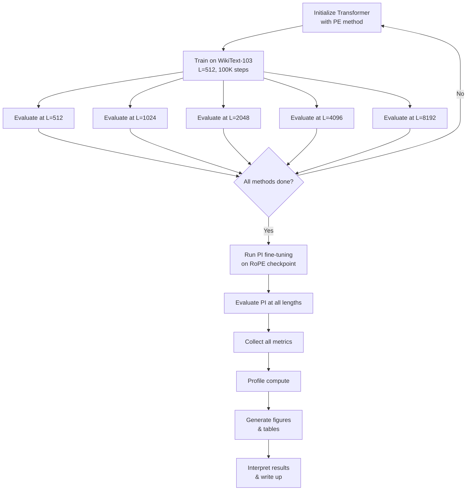
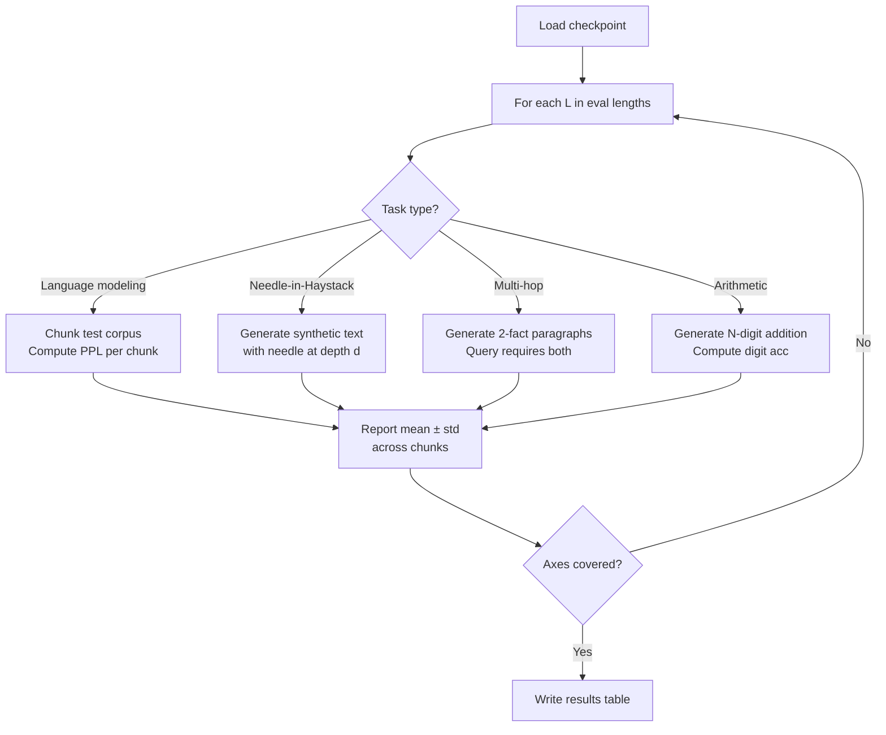

# Implementation Plan

## Overview

This document defines a complete, implementable methodology for empirically comparing positional encoding (PE) methods for length extrapolation in decoder-only Transformers. Every step maps to code in `.ai/IMPLEMENTATION/src/`.

---

## 1. Theoretical Framework

### 1.1 Self-Attention and Positional Symmetry

The scaled dot-product attention computes

```
Attention(Q, K, V) = softmax(Q @ K^T / sqrt(d_k)) @ V
```

where Q, K, V are linear projections of the input. Without positional information, permuting the input tokens produces identical attention scores. This permutation invariance is the fundamental problem PE methods solve.

### 1.2 Length Extrapolation

A model generalizes to unseen lengths when its attention distribution remains stable for sequences longer than the training maximum `L_train`. PE methods affect this through:

- **Distance awareness**: Does the method let the model distinguish near vs. far tokens?
- **Bounded representation**: Do position encodings stay in distribution at unseen indices?
- **Decay structure**: Does the method impose a built-in recency bias?

### 1.3 Taxonomy of Methods Tested

| Family | Method | PE Vector | Insertion Point | Trainable | Extrapolation Mechanism |
|--------|--------|-----------|-----------------|-----------|------------------------|
| Absolute | Learned | `p_i ∈ R^d` | Added to token embedding | Yes | None (fails) |
| Absolute | Sinusoidal | `sin/cos(ω_k i)` | Added to token embedding | No | Defined globally but model doesn't use it |
| Rotary | RoPE | Rotation matrix `R(θ, i)` | Applied to Q, K | No | Relative distance via rotation |
| Bias | ALiBi | `-m·|i-j|` | Added to QK^T | No | Fixed distance penalty |
| None | NoPE | — | — | N/A | Causal mask provides ordering |
| Kernel | KERPLE | `-γ·log(1+Δ)` or `-γ·Δ^κ` | Added to QK^T | Yes (γ, κ) | Kernelized distance decay |
| Context | CABLE | `f_context(q_i, k_j)` | Added to QK^T | Yes (MLP) | Content-conditioned bias |
| Extension | Position Interpolation | Scaled RoPE `R(θ, i·L_train/L_test)` | Applied to Q, K | No (fine-tune separate) | Coordinate compression |

---

## 2. Justification

### 2.1 Why an Experiment?

The current paper is solely literature-based. An experimental validation is needed because:

1. **Cross-paper comparison is confounded**: Papers use different model sizes, data, and training lengths. Direct numerical comparison of reported metrics is invalid.
2. **Claims need verification**: e.g., "ALiBi gives the strongest zero-shot extrapolation" — a controlled experiment tests this fairly.
3. **Practical guidance requires apples-to-apples data**: A practitioner choosing between methods needs to see them compared under identical conditions.

### 2.2 Method Selection Rationale

The 8 methods cover:
- **Historical baselines**: Learned, Sinusoidal (what early transformers used)
- **Production defaults**: RoPE (LLaMA family), ALiBi (research models)
- **Lightweight alternatives**: NoPE (surprising strong results in Kazemnejad 2023)
- **Post-hoc extensions**: Position Interpolation (most cited RoPE extension)
- **Recent innovations**: KERPLE, CABLE (2022–2025 advances)

---

## 3. Research Design

### 3.1 Design Type

Controlled experiment. Each PE method is the **independent variable**; all other architectural and training hyperparameters are held fixed. The **dependent variables** are the evaluation metrics across the five comparison axes.

### 3.2 Experimental Protocol

```
For each PE method in {Learned, Sinusoidal, RoPE, ALiBi, NoPE, KERPLE, CABLE}:
  1. Initialize a decoder-only Transformer with that PE
  2. Train on WikiText-103 (L_train = 512) for 100K steps
  3. Evaluate at lengths L ∈ {512, 1024, 2048, 4096, 8192}:
     a. Language modeling perplexity
     b. Needle-in-a-Haystack accuracy
     c. Multi-hop retrieval accuracy
     d. Recency bias score
  4. Profile: FLOPs, parameters, throughput

For Position Interpolation:
  1. Take trained RoPE checkpoint
  2. Apply PI scaling (L_test / L_train)
  3. Fine-tune for 5K steps on L_test-length sequences
  4. Evaluate same metrics
```

### 3.3 Contamination Control

- All methods use the **same random seed**, **same data order**, **same optimizer**
- NoPE gets the same decoder-only architecture (causal mask naturally provides ordering)
- Position Interpolation is separate because it requires a pre-trained RoPE base

---

## 4. Data Collection

### 4.1 Training Data

| Dataset | Use | Size | Domain | Preprocessing |
|---------|-----|------|--------|---------------|
| WikiText-103 | Training (main) | 103M tokens | Wikipedia articles | GPT-2 tokenizer, split by article, chunk to blocks |
| PG-19 | Evaluation (perplexity) | 11B tokens | Books (pre-1923) | Chunk to evaluation lengths |

### 4.2 Evaluation Tasks

| Task | What It Measures | Metric | Source |
|------|-----------------|--------|--------|
| Language modeling | Extrapolation (perplexity) | PPL @ L | WikiText-103 test, PG-19 test |
| Needle-in-a-Haystack | Long-range retrieval | Accuracy @ distance | Synthetic |
| Multi-hop reasoning | Cross-document retrieval | Accuracy | Synthetic (2-hop) |
| Arithmetic (addition) | Length generalization | Digit accuracy | Synthetic (N-digit N+N) |

### 4.3 Synthetic Data Generators

All synthetic tasks are implemented in `src/data/synthetic.py` and generated on-the-fly — no storage needed.

---

## 5. Preprocessing

### 5.1 WikiText-103 Pipeline

```
Raw text → GPT-2 tokenizer → Token ids → Chunk into blocks of L_train → Batch
```

- File: `src/data/wikitext.py`
- Process: download → tokenize → cache as .npy → dataloader reads chunks
- Max L_train = 512; for evaluation, chunks are L_eval without overlap

### 5.2 PG-19 Pipeline

```
Raw text → GPT-2 tokenizer → Token ids → Chunk at multiple lengths
```

- File: `src/data/pg19.py`
- Used only for evaluation; sampled at lengths {512, 1024, 2048, 4096, 8192}
- Sliding window evaluation with stride = L/2

### 5.3 Synthetic Tasks

- Generated in `src/data/synthetic.py`
- **Needle-in-a-Haystack**: Sequence of N tokens; needle (e.g., "The secret code is 12345") placed at position p; query at end asks "What is the secret code?"
- **Multi-hop**: Two facts at different positions; model must combine them to answer
- **Arithmetic**: "X + Y = " where X, Y have up to D digits

---

## 6. Implementation

### 6.1 Code Structure

```
.ai/IMPLEMENTATION/src/
├── config.py                  # Hyperparameters, model configs
├── model/
│   ├── __init__.py
│   ├── transformer.py         # Decoder-only Transformer
│   └── pe/
│       ├── __init__.py
│       ├── absolute.py        # Learned + Sinusoidal
│       ├── rope.py            # RoPE + Position Interpolation
│       ├── alibi.py           # ALiBi
│       ├── nope.py            # NoPE (identity fn)
│       ├── kerple.py          # KERPLE (log + power variants)
│       └── cable.py           # CABLE context-aware bias
├── data/
│   ├── __init__.py
│   ├── wikitext.py            # WikiText-103 dataloader
│   ├── pg19.py                # PG-19 evaluation dataloader
│   └── synthetic.py           # Synthetic task generators
├── train.py                   # Training entry point
├── evaluate.py                # Evaluation entry point
└── profile.py                 # Computational profiling
```

### 6.2 Model Architecture

| Parameter | Value |
|-----------|-------|
| n_layers | 12 |
| n_heads | 12 |
| d_model | 768 |
| d_ff | 3072 |
| d_head | 64 |
| vocab_size | 50257 (GPT-2) |
| max_seq_len | 512 (training) |
| dropout | 0.1 |
| activation | GELU |
| norm | Pre-LayerNorm |
| total params | ~85M |

### 6.3 Training Configuration

| Parameter | Value |
|-----------|-------|
| optimizer | AdamW (β₁=0.9, β₂=0.999, ε=1e-8) |
| learning rate | 3e-4 |
| schedule | Cosine with 2K warmup steps |
| weight decay | 0.1 |
| batch size | 64 |
| total steps | 100,000 (all methods) |
| gradient clipping | 1.0 |
| mixed precision | fp16 (Apex or native) |
| seed | 42 (all methods) |

### 6.4 PE Implementation Details

#### Learned Absolute (`absolute.py`)
```
Embedding(seq_len, d_model) → p_i = lookup[i] → h_i = x_i + p_i
```
- `nn.Embedding(max_seq_len, d_model)` — parameters only up to training length
- Evaluation: index errors for positions > max_seq_len; handled by clamping or extending with zeros

#### Sinusoidal (`absolute.py`)
```
p_i,2k   = sin(i / 10000^(2k/d_model))
p_i,2k+1 = cos(i / 10000^(2k/d_model))
```
- Precomputed for max evaluation length; same insertion as learned

#### RoPE (`rope.py`)
```
R(θ, i) @ q   → q_i is rotated by θ·i per dimension pair
R(θ, i) @ k_j → k_j is rotated by θ·j
(q_i)·(k_j)   → dot product depends on (i-j)
```
- Base θ = 10000; frequency per dim: `ω_k = θ^(-2k/d)`
- Applied in-place via complex multiplication or rotated 2D pairs

#### ALiBi (`alibi.py`)
```
score(i,j) = q_i·k_j - m_h · |i-j|
```
- Slope per head: `m_h = 2^(-8h/n_heads)` for h = 1, 2, ..., n_heads
- Precomputed bias matrix of shape (1, n_heads, L, L)

#### NoPE (`nope.py`)
```
attention(Q, K, V) = softmax(Q @ K^T / sqrt(d_k)) @ V
```
- No modification to attention; causal mask is the only ordering signal

#### KERPLE (`kerple.py`)
```
score(i,j) = q_i·k_j - γ_h · log(1 + |i-j|)      # Log variant
score(i,j) = q_i·k_j - γ_h · |i-j|^κ_h           # Power variant
```
- γ_h is learned per head (scalar); κ is per-head for power variant
- Parameters: ~2 per head (24 total for 12 heads)

#### CABLE (`cable.py`)
```
bias(i,j) = MLP([q_i ⊙ k_j; |i-j|])              # Simplified
# Or: bias(i,j) = w_h^T · [q_i ⊕ k_j] · f(|i-j|)
```
- Lightweight per-head network (1-2 linear layers, hidden dim 16)
- Content-conditioned bias: depends on both query/key content and distance

#### Position Interpolation (`rope.py`)
```
i_scaled = i · L_train / L_test
R(θ, i_scaled) @ q
```
- Simple scaling of position indices before RoPE application
- Separate fine-tuning script (`train.py --method pi`)

### 6.5 Training Loop (`train.py`)

```
for step in range(total_steps):
    batch = dataloader.next()          # shape: (B, L)
    logits = model(batch)               # forward
    loss = cross_entropy(logits[:, :-1], batch[:, 1:])
    loss.backward()
    optimizer.step()
    scheduler.step()
    if step % eval_interval == 0:
        val_ppl = evaluate(model, val_loader)
        log_metrics(step, loss, val_ppl, lr)
```

### 6.6 Evaluation Loop (`evaluate.py`)

```
def evaluate(model, dataset, lengths=[512, 1024, 2048, 4096, 8192]):
    results = {}
    for L in lengths:
        data = dataset.get_chunks(L)
        perplexities = []
        for chunk in data:
            logits = model(chunk)
            loss = cross_entropy(logits[:, :-1], chunk[:, 1:])
            perplexities.append(exp(loss))
        results[L] = mean(perplexities)
    return results
```

### 6.7 Profiling (`profile.py`)

```
def profile(model, pe_method, L):
    # FLOPs: count multiply-adds in one forward pass
    flops = compute_flops(model, seq_len=L)
    # Parameters: count params in PE module vs. total
    params = count_params(model)
    params_pe = count_params(model.pe_module)
    # Throughput: tokens/sec
    throughput = measure_throughput(model, seq_len=L, batch_size=64)
    return {flops, params, params_pe, throughput}
```

---

## 7. Evaluation

### 7.1 Metrics per Axis

| Comparison Axis | Primary Metric | Secondary Metric |
|---|---|---|
| Zero-shot extrapolation | PPL(L_test) / PPL(L_train) ratio | Raw PPL @ each length |
| Fine-tuning requirements | Steps to reach PPL(L_test) ≤ PPL_base | Compute cost per step |
| Recency bias | Accuracy(near) - Accuracy(far) | Attention entropy on far tokens |
| Long-range retrieval | Needle accuracy @ distance | Multi-hop accuracy |
| Compute cost | FLOPs per forward pass | Training time (hours) |

### 7.2 Hypothesis Tests

- **Extrapolation**: Does method X have significantly lower PPL at L_test than method Y? (paired bootstrap across 5 eval seeds)
- **Recency bias**: Is the accuracy gap between near/far tokens smaller for method X than Y?
- **Retrieval**: Is needle accuracy at 75% context depth higher for method X than Y?

### 7.3 Visualization Plan

All figures code-generated in `notebooks/analysis.ipynb`:

1. **PPL vs. Sequence Length** (line chart, 8 methods × 5 lengths)
2. **Needle Accuracy vs. Context Depth** (line chart, 8 methods × depth percentiles)
3. **Recency Bias Score** (bar chart, one bar per method)
4. **Compute vs. Extrapolation** (scatter plot, FLOPs on x-axis vs. PPL ratio on y-axis)
5. **Attention Maps** (heatmaps at L=2048 for selected methods)

---

## 8. Analysis

### 8.1 Expected Analysis Pipeline

```
collect_raw_metrics → aggregate_stats → hypothesis_tests → visualize → interpret
```

Implemented in `notebooks/analysis.ipynb` and `src/analysis.py`.

### 8.2 Interpretation Framework

For each comparison axis, the analysis answers:

1. **Zero-shot**: Does a clear ranking emerge? Is ALiBi truly the best zero-shot, or does RoPE catch up at certain lengths?
2. **Fine-tuning**: How much extra compute does PI need to match ALiBi's zero-shot at the same length?
3. **Recency bias**: Is the ALiBi recency bias as severe as the literature claims when measured directly?
4. **Retrieval**: Do context-aware methods (CABLE, KERPLE) actually improve retrieval over fixed-bias methods?
5. **Compute**: Is the FLOPs gap between methods consistent with what the literature says?

### 8.3 Reported Tables

- **Table 1 (Experimental)**: PPL at all 5 lengths for all 8 methods (replaces or augments current literature-only Table 1)
- **Table 2**: Needle accuracy at 25%, 50%, 75%, 90% context depth
- **Table 3**: Recency bias scores + compute profile (FLOPs, params, throughput)
- **Table 4**: Fine-tuning cost for PI (steps to recovery, final PPL)

---

## Flowchart: Experimental Pipeline



## Flowchart: PE Method Selection

```mermaid
flowchart TD
    A[Select PE method] --> B{Method type?}
    B -->|Absolute| C[Learned: nn.Embedding<br/>Sinusoidal: precompute]
    B -->|Rotary| D[RoPE: complex rotation<br/>PI: scale indices]
    B -->|Bias| E[ALiBi: static slope matrix<br/>KERPLE: learned γ]
    B -->|Context| F[CABLE: light MLP<br/>per-head bias]
    B -->|None| G[NoPE: no change]
    C --> H[Build Transformer<br/>(decoder-only)]
    D --> H
    E --> H
    F --> H
    G --> H
    H --> I[Training loop]
```

## Flowchart: Evaluation Protocol


